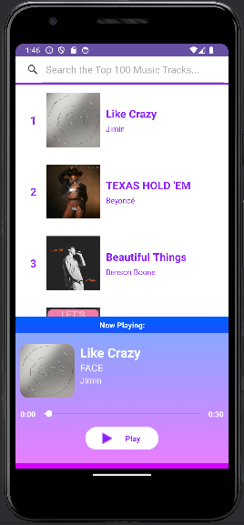

# Music-Player-App
This application is designed to showcase the top 100 tracks worldwide using the DeezerAPI and provide users with a 30-second preview of selected songs.

## Getting Started
To begin using Music Player App, follow these steps:
- **Obtain Your API Key:** Visit [Deezer API](https://rapidapi.com/deezerdevs/api/deezer-1/) to obtain your API key.
- **Update API Key:** After obtaining your API key, replace the placeholder string in `MusicSearchFragment.kt` with your actual API key:
```kotlin
private val apiKey = "REPLACE_WITH_YOUR_API_KEY"
```


## Features
- Display the top 100 tracks worldwide.
- Provide a 30-second preview of selected songs.
- Use a Web Service as the source of data and make API calls.


## User Interface
The following screenshots show the user interface, displaying different screens and interactions:


### Music Track Selection
| Opening the App        | Selecting a Music Track           |
| ------------- |:-------------:|
|  |  |


### Search Filtering
| Searching a Song        | Filtering           |
| ------------- |:-------------:|
|  |  | 


## Technical Details
Here are the key components of the application:
- **API Usage:** The app utilizes the DeezerAPI to fetch the top worldwide tracks and song previews.
- **User Interface Elements:** The UI components include SearchView, ImageView, and Seekbar.
- **Fragments:** `MusicSearchFragment` and `MusicPreviewerFragment` are utilized for different functionalities within the app.


## Development Environment
- IDE: Android Studio Hedgehog | 2023.1.1 Patch 2
- Language: Kotlin
